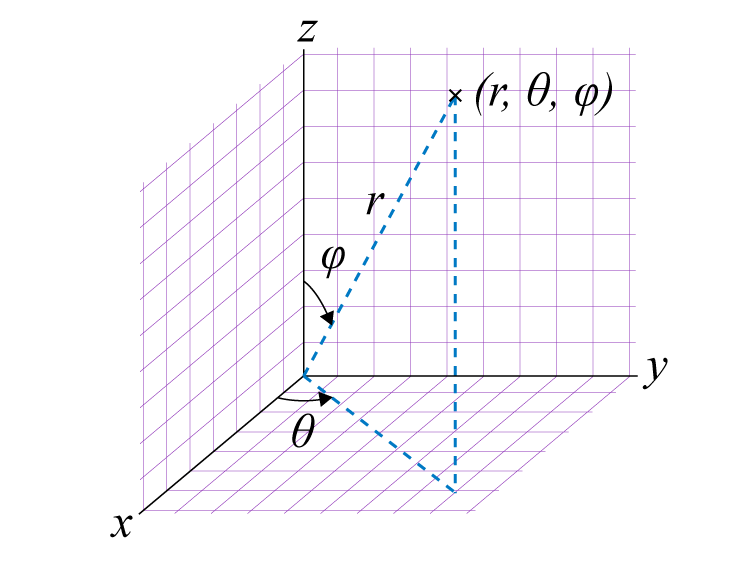

# Thruster-Arrangement-Utility
TAU is a tool for generating 3d surface plots indicating max thrust at zero torque of a group of thrusters

To use, run tau.py with a thruster layout JSON file in your working directory. The program should output a 3d surface indicating your maximum thrust in each direction that produces zero torque.

This program was initially created with the design of underwater ROVs in mind, but could easily be expanded to many other things.

Note that the coordinate system for this program uses aircraft-style coordinates rather than conventional ones. 

## Installation
1. Install [Python 3.9](https://www.python.org/downloads/release/python-3913/). Other versions will probably work but one of the libraries didn't work for me on 3.12.
2. Install [Git](https://git-scm.com/download/), if you haven't already.
3. Clone the repository through your IDE or by running `git clone https://github.com/Team1157/Thruster-Arrangement-Utility.git`
4. From the folder you just download, install the requirements by running `pip install -r requirements.txt`
5. Run the program: `python tau.py`

## Configuration
You can input your own thruster layout by modifying `thrusters.json`. This is the format of the file:
```js
[
  {
    "x": 1,
    "y": 1,
    "z": 0,
    "theta": -45,
    "phi": 90
  }, 
  // more thrusters ...
]
```
The `x`, `y`, and `z` fields are the x, y, and z coordinates of the thruster. See the above image for the coordinate system. The positions should be relative to the vehicle's center of mass (this affects the reference point used for torque measurements). Units are arbitrary, though meters will generally result in properly scaled graphs.

The `theta` and `phi` fields represent the orientation of the thruster. Theta is the angle of the thruster projected on the xy plane, counter-clockwise from the x-axis (standard math specification), in degrees. Phi is the angle between the thruster's axis of thrust and the +z axis (which points down), in degrees. Therefore a thruster with a `phi` of 0 represents a thruster pointed straight down and a `phi` of 180 represents a thruster pointing straight up. 



## TODO
 - add a GUI
 - ~~make the output surface less jagged~~
 - add a way to show individual thruster values at a given point
 - make sure the thrusters are sharing load equally
 - ~~accurately show surfaces when the vehicle has fewer than 6 dof~~
